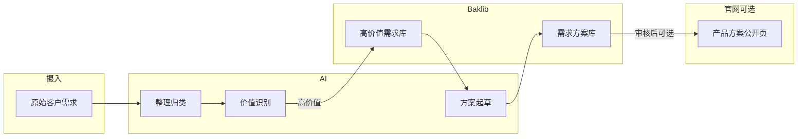

# 场景：客户需求 → AI 整理 → Baklib 高价值库与方案库 → 可选官网发布

本分支演示：**批量读取客户需求**，用 **AI 归类、去噪与价值判断**，将**高价值需求**写入 **Baklib「高价值需求库」**；再对每条高价值需求做**深度分析与方案设计**，产出**需求设计方案**并发布到 **Baklib「需求方案库」**；必要时将方案**公开发布到公司官网「产品方案」**板块。

- 上游能力安装：[baklib-tools/skills](https://github.com/baklib-tools/skills)  
- 返回全仓库场景索引：检出 `main` 分支，阅读根目录 [README.md](https://github.com/baklib-tools/skills-demo/blob/main/README.md)。

## 第一步：安装本场景依赖的 Cursor 技能

本场景先接入 **baklib-mcp**（经 MCP 操作 Baklib 知识库 / 站点 / DAM 等）与 **baklib-intake-assistant**（配合 MCP 的本地镜像录入、SQLite 台账与脚本工具链）。安装方式与上游一致，见 [baklib-tools/skills 仓库 README](https://github.com/baklib-tools/skills#readme)。

### 命令行安装（推荐）

需已安装 [Node.js](https://nodejs.org/)，在**本仓库根目录**执行：

```bash
npx --yes ctx7 skills install /baklib-tools/skills baklib-mcp --cursor
npx --yes ctx7 skills install /baklib-tools/skills baklib-intake-assistant --cursor
```

- 使用 **`--cursor`** 可直接安装到本项目的 `.cursor/skills/`，无需在交互菜单里勾选。
- 若未加 `--cursor`，安装器会询问目标环境，请选择 **Cursor (.cursor/skills)**。

### 若 `ctx7` 提示找不到 `baklib-intake-assistant`

可改用上游文档中的 **手动拷贝**：从 [skills/baklib-intake-assistant](https://github.com/baklib-tools/skills/tree/main/skills/baklib-intake-assistant) 将整个目录复制到本仓库 `.cursor/skills/baklib-intake-assistant/`，保留 `SKILL.md`、`scripts/` 等结构。

### 安装后

- 按 **baklib-mcp** 内 `SKILL.md` 配置 MCP 服务与鉴权（版本与能力以前端 skill 说明为准）。  
- 按 **baklib-intake-assistant** 内 `SKILL.md`、`local-mirror.md` 理解镜像根目录、`知识库/`、`资源库/`、`站点/` 与台账约定。

本仓库已在 `.cursor/skills/` 中附带上述两技能的副本，便于演示环境开箱即用；仍建议对照上游仓库保持更新。

### MCP 与 `${workspaceFolder}`（Agent 窗口注意）

若在 `mcp.json` 里用 `"BAKLIB_MCP_WORKSPACE": "${workspaceFolder}"`：**Cursor Agent 窗口**与 **Editor 窗口**的工作区根可能不一致，变量未必指向本仓库根目录，项目内 `.config/BAKLIB_MCP_TOKEN` 可能读不到。建议将 `BAKLIB_MCP_WORKSPACE` 设为**本仓库绝对路径**，或使用 **`~/.config/BAKLIB_MCP_TOKEN`**。详见 [HOW-TO-BUILD-THIS-SCENARIO.md](HOW-TO-BUILD-THIS-SCENARIO.md) 中 **「Cursor Agent 窗口与 `${workspaceFolder}`」**。

## 业务目标

| 阶段 | 产出 | 存放位置（示例命名，可按组织实际调整） |
| --- | --- | --- |
|  intake | 原始需求批次（文本/表格/工单导出等） | 过程数据，可不长期入 Baklib |
|  整理与筛选 | 结构化条目、标签、优先级、是否「高价值」 | **Baklib：高价值需求库**（仅入库通过筛选的条目） |
|  方案设计 | 每条高价值需求对应的设计说明、范围、里程碑、风险 | **Baklib：需求方案库** |
|  对外传播 | 脱敏后的产品级方案页 | **公司官网：产品方案**（可与 Baklib 发布联动或手工同步） |

## 推荐流程（可与 Agent 分步配合）



1. **准备输入**  
   将客户需求整理为模型易消费的格式（纯文本、Markdown、CSV 一行一条、或从 CRM/工单导出经简单清洗）。体量很大时可分批，并记录批次 ID，便于追溯。

2. **AI 整理与价值识别**  
   让 AI 完成：去重、合并同义表述、打标签（产品线、客户类型、痛点类型等）、粗评完整度与可行性，并给出**是否进入高价值库**的结论与简短理由。  
   **建议**：对「高价值」定义写成明确规则（例如：付费客户、明确预算、与当年 roadmap 重合等），减少模型主观漂移。

3. **写入 Baklib「高价值需求库」**  
   仅将通过筛选的条目写入；每条建议包含：标题、摘要、原始引用或链接、标签、优先级、录入批次、AI 评估摘要。  
   具体写入方式取决于你们使用的 Baklib 能力（控制台、API、或与 [baklib-tools/skills](https://github.com/baklib-tools/skills) 中相关 skill 对接）。

4. **逐条分析与方案设计**  
   以高价值库中条目为输入，让 AI 生成**需求设计方案**（建议结构）：背景与目标、用户与场景、范围 In/Out、用户故事或验收要点、依赖与风险、里程碑建议。  
   **建议**：强制人工审核后再定稿入库。

5. **发布到 Baklib「需求方案库」**  
   将定稿方案作为独立文档或结构化页面写入方案库，并与对应高价值需求条目**双向链接**（需求 ID / URL），便于从需求跳到方案、从方案回溯需求。

1. **命名确认**：按上文的 `scenario/<slug>` 规则，向你**提议**分支名和简短场景说明；**在你明确同意之前**，不应改文件、不应提交、不应创建分支。
2. **更新导航**：切换到 **`main`**，在下方「场景分支」表中**新增一行**（分支名、场景说明、文档入口可写「检出该分支后阅读根目录 `README.md`」）。
3. **提交**：**仅提交**本次导航相关变更（通常只有 `README.md`），提交说明可用简体中文（例如「文档：新增场景 xxx 导航」）。
4. **创建场景分支**：在已包含该提交的 **`main`** 上执行 `git checkout -b <已确认的分支名>`。之后该场景的 README、示例与脚本**只在此分支**演进，避免堆在 `main`。
5. **初始化场景技能目录（必须）**：在本分支创建 `.cursor/skills/<slug>/SKILL.md`（`<slug>` 为分支名中 `scenario/` 之后的段），含合法 frontmatter 与占位说明；不得只建分支不建该目录。详见 [AGENTS.md](AGENTS.md)。
6. **初始化构建手记（建议）**：在同分支根目录添加 `HOW-TO-BUILD-THIS-SCENARIO.md` 占位并逐步补充。

## 与 baklib-tools/skills 的配合

1. 按 [baklib-tools/skills](https://github.com/baklib-tools/skills) 文档完成安装与鉴权（如 token、工作区配置）。  
2. 在本仓库或业务仓库中，让 Agent 根据已安装的 skill 调用说明，将「整理结果」「高价值条目」「方案文档」写入 Baklib 对应知识库/站点。  
3. 若上游新增专用 skill（例如批量创建条目、发布站点），以该仓库最新说明为准，本场景只定义**业务链路与文档结构**，不绑定具体 API 形态。

## 质量与合规注意点

- **隐私与脱敏**：对外发布前必须剥离客户标识、合同金额等敏感信息。  
- **人机协同**：价值判定与方案定稿建议保留人工确认环节，避免模型误判直接进入对外渠道。  
- **可追溯**：保留批次 ID、模型版本或提示策略版本记录，便于事后审计与复现。

## 本分支维护说明

场景相关的脚本、模板、示例提示词或配置文件可放在本分支子目录（例如 `examples/`、`prompts/`），**不要**在 `main` 上堆积此类内容；导航表仅在 `main` 的 README 中维护。新建场景、分支命名与 Agent 协作约定见 [AGENTS.md](AGENTS.md)。

**构建本场景的分步清单与决策记录**（面向复现与贡献者）见同目录 [HOW-TO-BUILD-THIS-SCENARIO.md](HOW-TO-BUILD-THIS-SCENARIO.md)。
